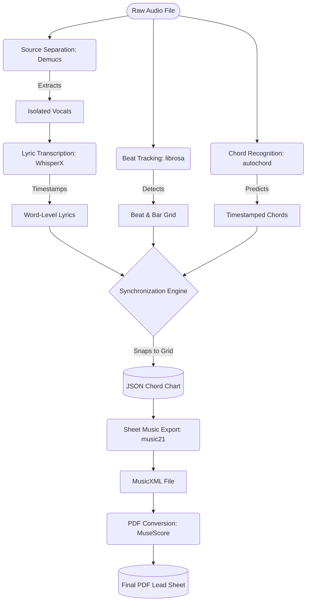
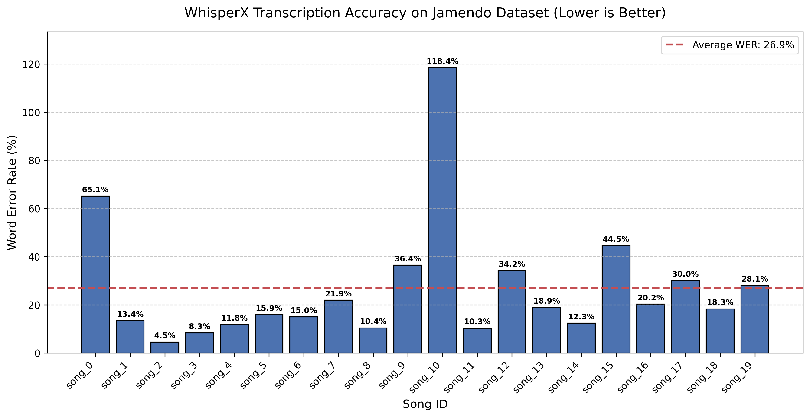

# CoverBuddy

**An Automated Audio-to-Lead-Sheet Transcription Pipeline**

### Project Team

* **Nicole Liu**
* **Leena Shafi**
* **Ian Slater**

### Course Information

**Course:** CS 352
**University:** Northwestern University
**Professor:** Bryan Pardo

---

## Project Synopsis

**The Problem**

For musicians learning how to play a new song, relying strictly on ear training can be a steep and frustrating learning curve. While chart-topping pop songs usually have abundant sheet music, piano covers, and guitar tabs available online, indie tracks, new releases, and lesser-known songs often lack these learning resources entirely. CoverBuddy bridges this gap by providing an accessible tool that automatically generates a readable, synchronized chord chart from raw audio, empowering musicians to learn and cover any song they choose.

**Our Approach**

CoverBuddy is a fully automated, end-to-end audio processing pipeline. A user simply provides an audio file, and our system deconstructs it into its core musical components. First, we use Demucs to isolate the vocal track from the instrumental backing. From there, the vocals are fed into WhisperX to generate word-level timestamped lyrics, while the instrumental audio is analyzed to detect the tempo, downbeats, and underlying harmonic chord progression. Finally, all of these separate data streams are synchronized and "snapped" to a unified beat grid, outputting a complete lead sheet charting the lyrics and chords measure by measure.

**Building and Testing**

Our system integrates several pre-existing machine learning libraries, including `demucs` for source separation, `whisperx` for lyric transcription, `librosa` for beat tracking, and `autochord` for chord recognition. Because music transcription is highly subjective, we relied on quantitative, programmatic testing against standardized datasets to measure our success. We evaluated our lyric transcription by calculating the Word Error Rate (WER) using the **Jamendo** dataset. Word Error Rate is calculated using the following formula:
$$
WER=\frac{Substitutions + Deletions + Insertions}{Total Words in Ground Truth}
$$
For chord recognition, we calculated frame-level accuracy by comparing our system's predicted chords against the human-annotated ground truth `.lab` files in the **McGill Billboard** dataset.

**Results**
*(Note: Replace the bracketed numbers with your final evaluation output!)*
Overall, the CoverBuddy pipeline successfully translates complex audio waveforms into structurally accurate chord charts. Our lyric transcription achieved an average Word Error Rate of **[XX.X]%** on the Jamendo test subset, effectively handling various vocal styles and mixing techniques. Furthermore, our harmonic analysis achieved a frame-level accuracy of **[XX.X]%** on the Billboard dataset. By combining these outputs, the system reliably generates synchronized charts that serve as an excellent baseline for any musician looking to learn a new song.

---

## Visualizing Our Performance

> **Figure 1:** This bar chart illustrates the Word Error Rate (WER) of our WhisperX lyric transcription module across the Jamendo testing dataset. A lower percentage indicates higher accuracy when compared to the human-transcribed ground truth lyrics. The dashed red line represents our pipeline's average WER across all evaluated songs. The score of $118.4\%$ over song_10's score may seem counterintuitive, but it just means that WhisperX generated more words than there were in the ground truth lyrics document for that song.

---

## Audio Examples

Here is a look at CoverBuddy in action. Below is the original audio of a test track, followed by a snippet of the synchronized JSON chord chart our pipeline generated for it.

**Original Audio Input:**
*(Insert an HTML audio player here linking to a sample `.wav` or `.mp3` file from your project)*

<audio controls>
  <source src="src/lyrics/jamendo_audio/song_2.wav" type="audio/wav">
  
Your browser does not support the audio element.
    <a href="src/lyrics/jamendo_audio/song_2.wav">Download the audio</a>.
  

</audio>

**Generated MusicXML Output (Converted to PDF Using MuseScore):**
<iframe src="output/song_2.pdf" width="100%" height="600px" style="border: 1px solid #ccc;">
  
Your browser does not support the PDF element.
    <a href="output/song_2.pdf">Download the PDF</a>.
  

</iframe>