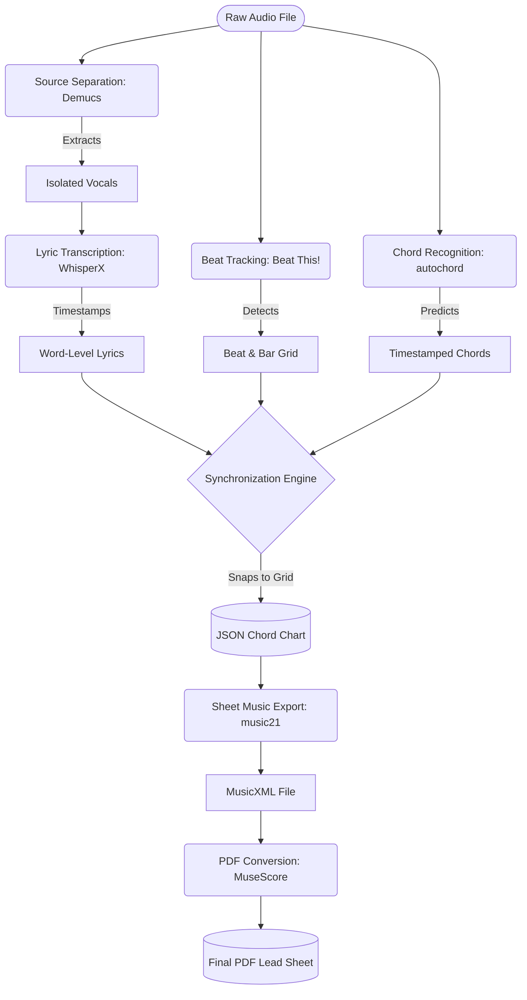
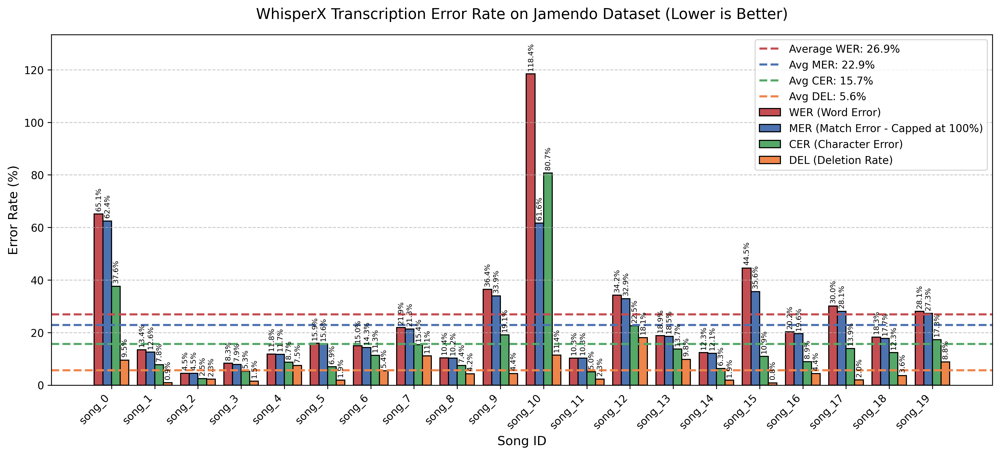

# CoverBuddy

**An Automated Audio-to-Lead-Sheet Transcription Pipeline**

### Project Team

* **Nicole Liu**
* **Leena Shafi**
* **Ian Slater**

### Course Information

**Course:** CS 352
**University:** Northwestern University
**Professor:** Bryan Pardo

---

## Project Synopsis

**The Problem**

For musicians learning how to play a new song, relying strictly on ear training can be a steep and frustrating learning curve. While chart-topping pop songs usually have abundant sheet music, piano covers, and guitar tabs available online, indie tracks, new releases, and lesser-known songs often lack these learning resources entirely. CoverBuddy bridges this gap by providing an accessible tool that automatically generates a readable, synchronized chord chart from raw audio, empowering musicians to learn and cover any song they choose.

**Our Approach**

CoverBuddy is a fully automated, end-to-end audio processing pipeline. A user simply provides an audio file, and our system deconstructs it into its core musical components. First, we use Demucs to isolate the vocal track from the instrumental backing. From there, the vocals are fed into WhisperX to generate word-level timestamped lyrics, while the instrumental audio is analyzed to detect the tempo, downbeats, and underlying harmonic chord progression. Finally, all of these separate data streams are synchronized and "snapped" to a unified beat grid, outputting a complete lead sheet charting the lyrics and chords measure by measure.

**Building and Testing**

Our system integrates several pre-existing machine learning libraries, including `demucs` for source separation, `whisperx` for lyric transcription, `beat_this` for beat tracking, and `autochord` for chord recognition. Because music transcription is highly subjective, we relied on quantitative, programmatic testing against standardized datasets to measure our success. We evaluated our lyric transcription by calculating the Word Error Rate (WER) using the **Jamendo** dataset. Word Error Rate is calculated using the following formula:
$$
WER=\frac{Substitutions + Deletions + Insertions}{Total Words in Ground Truth}
$$
For chord recognition, we calculated frame-level accuracy by comparing our system's predicted chords against the human-annotated ground truth `.lab` files in the **McGill Billboard** dataset.

**Results**
Overall, the CoverBuddy pipeline successfully translates complex audio waveforms into structurally accurate chord charts. Our lyric transcription achieved an average Word Error Rate of 26.9% on the Jamendo test subset, effectively handling various vocal styles and mixing techniques. For beat tracking on 93 evaluated excerpts, beat_this outperformed librosa across every reported metric: mean F-measure improved from 81.2% to 95.1%, tempo accuracy within 8% improved from 84.9% to 92.5%, and mean absolute timing error dropped from 30.0 ms to 10.6 ms. By combining these outputs, the system reliably generates synchronized charts that serve as an excellent baseline for any musician looking to learn a new song.

---

## Visualizing Our Performance

> **Figure 1:** This grouped bar chart illustrates the performance of the WhisperX lyric transcription module across the Jamendo testing dataset using four key metrics: Word Error Rate (WER), Match Error Rate (MER), Character Error Rate (CER), and Deletion Rate. For all metrics, a lower percentage indicates higher accuracy when compared to the human-transcribed ground truth. The dashed lines represent the pipeline's average score for each respective metric across all evaluated songs. 
>
> While WER is the industry standard, it mathematically exceeds 100% (as seen with song_10's score of 118.4%) if the model hallucinates more words than exist in the actual lyrics. To provide a more bounded and nuanced perspective, we included MER (which mathematically caps errors at 100%), CER (which evaluates accuracy letter-by-letter, which is a slightly better way of measuring words that may be phonically similar but semantically different, a source of error that EJ pointed out), and the Deletion Rate (which tracks the percentage of ground truth words completely missed by the pipeline).

---

## Audio Examples

Here is a look at CoverBuddy in action. Below is the original audio of a test track, followed by the exported PDF outputs from the baseline pipeline and the Beat This! version.

**Original Audio Input:**

<audio controls>
  <source src="src/lyrics/jamendo_audio/song_2.wav" type="audio/wav">
  
Your browser does not support the audio element.
    <a href="src/lyrics/jamendo_audio/song_2.wav">Download the audio</a>.
  

</audio>

**Original `song_2` PDF Output:**
<iframe src="output/song_2.pdf" width="100%" height="600px" style="border: 1px solid #ccc;">
  
Your browser does not support the PDF element.
    <a href="output/song_2.pdf">Download the PDF</a>.
  

</iframe>

**`song_2_beat_this` PDF Output:**
<iframe src="output/song_2_beat_this.pdf" width="100%" height="600px" style="border: 1px solid #ccc;">
  
Your browser does not support the PDF element.
    <a href="output/song_2_beat_this.pdf">Download the PDF</a>.
  

</iframe>
